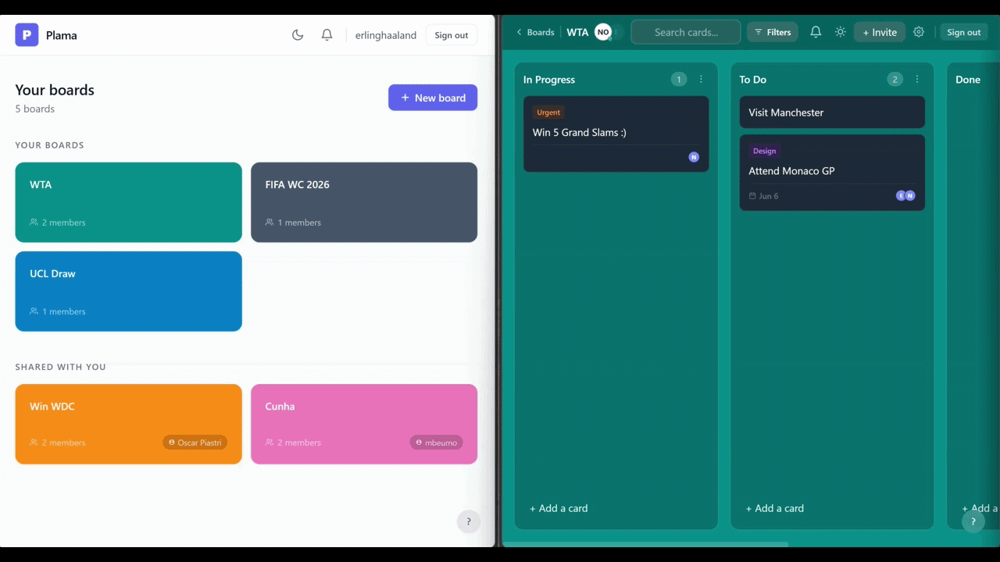

#  Plama

> Real-time collaborative Kanban board. Multiple users, one board, zero friction.



**Live demo:** [plama.vercel.app](https://plama.vercel.app)

---

## What Problem Does This Solve?

Remote teams need lightweight, real-time collaboration without the complexity or cost of Trello or Jira. Plama demonstrates production-grade real-time architecture — the same patterns used in trading platforms, collaborative design tools, and live dashboards — applied to a problem everyone understands.

---

## Features

- **Real-time sync** — Card and list changes propagate to all users in <50ms
- **Optimistic UI** — Every action feels instant; the UI updates before the server confirms
- **Live presence** — See who's online, who's away, and who's actively on your board
- **Drag-and-drop** — Reorder cards within lists, move cards across lists, reorder lists — all synced in real time
- **Notifications** — Personal alerts pushed instantly via WebSocket (assignment, comments, invites, card moves); badge updates without polling
- **Board ownership** — Dashboard separates your boards from boards shared with you, with owner attribution
- **Activity log** — Full board history: who did what and when
- **Undo** — Destructive actions (delete card, delete list, delete board) have a 5-second cancellation window before committing
- **Conflict resolution** — Concurrent card moves are wrapped in database transactions; failed operations roll back gracefully on all clients
- **Auth** — JWT-based authentication with Google OAuth and email/password; protected routes and role-aware UI (owners vs. members)
- **Dark mode** — Persistent preference, toggle from any screen
- **Graceful degradation** — Connection loss banner, automatic reconnection, board rejoin on reconnect

---

## Architecture

```
┌─────────────────────────────────────────────────────────────────┐
│                       CLIENT (React SPA)                         │
│   React + TypeScript + Zustand + @dnd-kit + Socket.io-client     │
└────────────────────────┬────────────────────────────────────────┘
                         │
            HTTP REST + WebSocket (Socket.io)
                         │
┌────────────────────────┴────────────────────────────────────────┐
│                      SERVER (Node.js)                            │
│          Express REST API + Socket.io Event Handlers             │
└──────────────┬──────────────────────────┬───────────────────────┘
               │                          │
        ┌──────┴──────┐          ┌────────┴────────┐
        │ PostgreSQL  │          │     Redis        │
        │  (Neon)     │          │   (Upstash)      │
        │ Persistent  │          │ Presence/Cache   │
        │   storage   │          │                  │
        └─────────────┘          └─────────────────┘
```

**Communication pattern:**
- **REST API** — Auth, initial board load, list and board CRUD
- **WebSocket (board room)** — All card mutations, list moves, presence events; broadcast to `board:{id}` room
- **WebSocket (user socket)** — Personal notifications pushed directly to the recipient's socket, bypassing the board room entirely

**Why this split?** REST for correctness (initial data must be consistent), WebSocket for speed (real-time events need sub-100ms propagation), and direct socket targeting for notifications (only the recipient should receive them).

---

## Technical Highlights

### Real-time Event Flow

```
User drags card
  → UI updates immediately (optimistic)
  → socket.emit('card-moved', { cardId, newListId, newPosition })
  → Server opens a PostgreSQL transaction
      → UPDATE cards SET list_id, position   (move the card)
      → UPDATE cards SET position - 1        (close gap in old list)
      → UPDATE cards SET position + 1        (make room in new list)
      → COMMIT  (or ROLLBACK if any step fails)
  → io.to('board:123').emit('card-moved', data)  ← broadcast to all
  → Other clients update their UI
  → If transaction fails → 'card-move-failed' → sender rolls back optimistic update
```

### Optimistic Updates

Every card mutation updates the local UI before server confirmation:

```typescript
// 1. Update UI immediately (0ms perceived latency)
addOptimisticCard({ ...card, isOptimistic: true, tempId });

// 2. Send to server via WebSocket
socket.emit('card-created', { ...data, tempId });

// 3a. Server confirms → replace optimistic card with real DB record
socket.on('card-created', ({ card, tempId }) => {
  const hasOptimistic = store().cards.find(c => c.tempId === tempId);
  hasOptimistic
    ? confirmOptimisticCard(tempId, card)  // sender: swap temp → real
    : addCard(card);                        // others: just add it
});

// 3b. Server fails → rollback
socket.on('card-error', ({ tempId }) => rollbackOptimisticCard(tempId));
```

### Concurrency

Card moves use a dedicated PostgreSQL transaction to prevent position corruption when two users move different cards in the same list simultaneously:

```typescript
await executeTransaction(async (client) => {
  await client.query(`UPDATE cards SET list_id=$1, position=$2 WHERE id=$3`, [...]);
  await client.query(`UPDATE cards SET position=position-1 WHERE list_id=$1...`, [...]);
  await client.query(`UPDATE cards SET position=position+1 WHERE list_id=$1...`, [...]);
  // All three succeed together, or all roll back
});
```

### Notifications Architecture

Notifications are pushed directly to the recipient rather than broadcast to the board room. This required breaking a circular import (`server.ts` → `handlers.ts` → `notifications.ts` → `server.ts`) with a dependency injection pattern:

```typescript
// notifications.ts — no direct import of io
let _io: Server | null = null;
export function setIo(io: Server) { _io = io; }

// server.ts — injects io after creation
setIo(io);

// On invite: push board data directly to recipient's socket(s)
for (const socketId of userSockets.get(inviteeId)) {
  _io.to(socketId).emit('notification', notification);
  _io.to(socketId).emit('board-invited', { board }); // dashboard updates instantly
}
```

### Presence Tracking

Redis hash per board stores active users with TTL. In-memory fallback if Redis is unavailable:

```typescript
await redis.hSet(`board:${boardId}:users`, userId, JSON.stringify({ id, name, joinedAt }));
await redis.expire(`board:${boardId}:users`, 3600);
```

### Socket Lifecycle

A named handler pattern prevents listener accumulation across React re-renders and board navigations:

```typescript
// All handlers stored by name — unbind removes only these, not all listeners
(socket as any)._boardHandlers = { onConnect, onCardCreated, onCardMoved, ... };

// Clean unbind on board unmount
s.off('card-created', h.onCardCreated);
s.off('card-moved',   h.onCardMoved);
// ...
```

---

## Tech Stack

| Layer | Technology | Why |
|-------|-----------|-----|
| Frontend | React + TypeScript + Vite | Type safety, fast HMR, modern bundling |
| State | Zustand | Minimal boilerplate, built for real-time mutation patterns |
| Real-time | Socket.io | Battle-tested WebSocket with rooms, reconnection, fallbacks |
| Drag & drop | @dnd-kit | Accessible, TypeScript-native, sortable contexts |
| Backend | Node.js + Express | Event-driven I/O, natural fit for WebSocket workloads |
| Database | PostgreSQL (Neon) | ACID transactions, relational integrity, serverless scaling |
| Cache/Presence | Redis (Upstash) | Sub-millisecond reads, built-in pub/sub for future scaling |
| Auth | JWT + Google OAuth | Stateless tokens, one-click sign-in via Google Identity Services |
| Validation | Zod | Runtime type safety on all API inputs |
| Logging | Pino | Structured JSON logs, negligible overhead |
| Deploy | Vercel + Northflank | Zero-config CI/CD, global CDN for static assets |

---

## Local Setup

### Prerequisites
- Node.js 20+
- Docker (for local PostgreSQL + Redis) **or** free accounts at [Neon](https://neon.tech) and [Upstash](https://upstash.com)

### 1. Clone & install

```bash
git clone https://github.com/yourusername/plama.git
cd plama

cd server && npm install
cd ../client && npm install
```

### 2. Configure environment

```bash
cd server && cp .env.example .env
# Fill in: DATABASE_URL, REDIS_URL, JWT_SECRET, CLIENT_URL
# Optional: GOOGLE_CLIENT_ID (for Google OAuth — get from Google Cloud Console)

cd ../client && cp .env.example .env
# VITE_API_URL can be left empty for local dev (Vite proxy handles it)
# Optional: VITE_GOOGLE_CLIENT_ID (same value as server's GOOGLE_CLIENT_ID)
```

### 3. Set up database

```bash
# Option A: Docker
docker run --name plama-postgres -e POSTGRES_PASSWORD=password -e POSTGRES_DB=plama -p 5432:5432 -d postgres
docker run --name plama-redis -p 6379:6379 -d redis

# Option B: Neon + Upstash (free cloud tiers) — update .env with their connection strings

# Run migrations
cd server && npm run db:migrate
```

### 4. Start

```bash
# Terminal 1
cd server && npm run dev

# Terminal 2
cd client && npm run dev
```

Open [http://localhost:5173](http://localhost:5173)

---

## Deployment

| Service | Used For | Cost |
|---------|----------|------|
| Vercel | Frontend + CDN | Free |
| Northflank | Backend server | Free tier (no spin-down) |
| Neon | PostgreSQL | Free (500MB) |
| Upstash | Redis | Free (10k req/day) |

**Total: $0/month**

### Backend → Northflank
1. Create a free account at [northflank.com](https://northflank.com)
2. Create a new project
3. Add a PostgreSQL addon — copy the connection string
4. Add a Redis addon — copy the connection string
5. Create a combined service, connect your GitHub repo, set root to `server/`
6. Build command: `npm install && npm run build && npm run db:migrate`
7. Start command: `npm start`
8. Add environment variables: `DATABASE_URL`, `REDIS_URL`, `JWT_SECRET`, `CLIENT_URL`, `NODE_ENV=production`
9. Deploy — Northflank containers stay running (no spin-down)

### Frontend → Vercel
```bash
cd client && vercel --prod
# Set VITE_API_URL to your Northflank backend URL
```

---

## Performance

Benchmarked using Artillery to measure core logic efficiency (Local) and infrastructure behavior (Live). It is optimized for high-concurrency real-time collaboration.

| Metric | Local (Docker Baseline) | Live (Northflank/Neon Free) |
| :--- | :--- | :--- |
| Avg Latency | ~2.8ms | ~45ms - 85ms |
| P95 Latency | ~4.0ms | ~180ms |
| P99 Latency | ~6.0ms | ~350ms |
| Throughput | ~270 Requests/sec | ~100 Requests/sec |
| Error Rate | 0.0% | < 0.1% |

*\* Live latency includes TCP/SSL handshakes (~30ms) and varies by user region. Initial requests may experience "Cold Start" delays (~500ms) due to Neon's serverless compute auto-suspend.*

### Infrastructure Strategy & Constraints
*   **Connection Pooling:** A fixed pool size of `max: 20` utilizes Neon's PgBouncer (Pooler) to support high concurrency while staying within free-tier connection limits (112 max).
*   **Security Throttling:** Strict rate limiting is applied to authentication routes (10 attempts/15 mins) to protect 0.2 vCPU resources from CPU-intensive Bcrypt hashing.
*   **Memory Management:** Optimized for 512MB RAM environments via `NODE_OPTIONS` to prevent OOM (Out of Memory) crashes during high-concurrency traffic spikes.

```bash
npm run test:load
```

See [docs/scaling.md](docs/scaling.md) for bottleneck analysis and the path to 1M+ users.

---

## Project Structure

```
plama/
├── client/
│   └── src/
│       ├── components/       # Board, List, Card, Notifications, UI
│       ├── hooks/            # useBoard (real-time state + actions), useUndo
│       ├── services/         # api.ts (REST), socket.ts (WebSocket + named handlers)
│       ├── store/            # Zustand stores (auth, boards, active board)
│       └── types/            # Shared TypeScript types
│
├── server/
│   └── src/
│       ├── routes/           # REST endpoints (auth, boards, lists, cards, notifications)
│       ├── socket/           # WebSocket handlers (real-time core + concurrency logic)
│       ├── db/               # PostgreSQL pools, executeTransaction, Redis client
│       ├── middleware/       # JWT auth, HTTP metrics collection
│       └── utils/            # Logger (Pino + request IDs), notifications, transforms
│
├── .github/workflows/ci.yml  # GitHub Actions CI (build, lint, test, deploy)
├── docker-compose.yml         # Postgres + Redis + Prometheus + Grafana
├── prometheus.yml             # Prometheus scrape config
└── grafana/provisioning/      # Auto-configured Prometheus data source
```

---

## Observability

Full observability stack: **Prometheus** for metrics, **Grafana** for dashboards, **Pino** for structured logs — all tailored for real-time WebSocket workloads.

### Metrics (Prometheus + Grafana)

The server exposes Prometheus-format metrics at `/metrics/prometheus`, covering:

| Category | Metrics |
|----------|---------|
| HTTP | `http_requests_total`, `http_request_duration_seconds` (with method, route, status labels) |
| WebSocket | `ws_connections_active`, `ws_events_total`, `ws_event_duration_seconds`, `ws_board_room_size` |
| Database | `db_query_duration_seconds` (read/write/transaction with success/error/rollback status) |
| App-specific | `plama_card_moves_total`, `plama_optimistic_rollbacks_total`, `plama_notifications_sent_total`, `plama_redis_presence_ops_total` |
| Node.js | Default `prom-client` metrics (heap, GC, event loop lag) |

The existing JSON `/metrics` endpoint is preserved for backward compatibility.

**Key Grafana queries:**

```promql
# WebSocket event throughput by type
sum(rate(ws_events_total[5m])) by (event)

# card-moved p95 latency
histogram_quantile(0.95, rate(ws_event_duration_seconds_bucket{event="card-moved"}[5m]))

# Optimistic rollback rate — rising = something wrong
sum(rate(plama_optimistic_rollbacks_total[5m])) by (event)

# DB transaction rollback ratio
rate(db_query_duration_seconds_count{status="rollback"}[5m])
  / rate(db_query_duration_seconds_count{operation="transaction"}[5m])

# Node.js event loop lag
nodejs_eventloop_lag_seconds
```

**Run the stack locally:**

```bash
docker compose up -d                # Starts Postgres, Redis, Prometheus, Grafana
cd server && npm run dev            # Start the server (port 3000)
```

- Prometheus: [http://localhost:9090](http://localhost:9090)
- Grafana: [http://localhost:3001](http://localhost:3001) (admin / admin)
- Prometheus data source is auto-provisioned — start building dashboards immediately

### Structured Logging (Pino)

Every log line is structured JSON in production with:
- `service`: `plama-server`
- `requestId`: UUID correlation ID (propagated via `x-request-id` header)
- `method`, `path`, `statusCode`, `duration` on every HTTP request

```json
{"level":30,"time":1712345678,"service":"plama-server","requestId":"a1b2c3d4","method":"GET","path":"/api/boards","statusCode":200,"duration":12,"msg":"request completed"}
```

Socket events include `userId` and `boardId` context via Pino child loggers.

### CI/CD (GitHub Actions)

On every push to `main` and every PR:

| Job | What it checks |
|-----|----------------|
| **Server — Build & Test** | TypeScript compile, DB migrations, Jest tests (with real Postgres + Redis service containers) |
| **Client — Lint & Build** | ESLint, TypeScript compile, Vite production build |

CI jobs run in parallel. Deployments to Vercel and Northflank are gated — they only trigger on push to main after both jobs pass, with the backend deploying before the frontend to prevent API mismatches. See [`.github/workflows/ci.yml`](.github/workflows/ci.yml).

---

## What I Learned

- **WebSocket architecture** — Event-driven systems require different mental models than request/response. Designing clean event contracts and handling the full lifecycle (connect, reconnect, room rejoin, cleanup) is non-trivial.
- **Optimistic updates** — The happy path is easy. The hard part is rollback: making sure failed server operations cleanly undo local state without jarring the user.
- **Concurrency** — Silent data corruption is worse than visible errors. Wrapping multi-step position updates in a database transaction turned a potential source of subtle bugs into a clear commit-or-rollback guarantee.
- **Circular dependencies** — Real-time systems that need to push events from utility code create circular import chains. Dependency injection (passing `io` in rather than importing it) is the clean solution.
- **Listener lifecycle** — Naive WebSocket code accumulates duplicate event listeners on re-render. Named handler references and explicit unbinding on unmount are essential for correctness.
- **Scale first in structure, not in code** — The codebase separates read/write DB pools, uses environment flags for Redis pub/sub and read replicas, and namespaces all socket rooms. None of that costs anything now, but it means scaling later doesn't require a rewrite.

---

## License

MIT - see the [LICENSE](LICENSE) file for details.